# 🧞‍♂️ Genie - Your Web3 AI Agent

<div align="center">


[](https://github.com/elizaOS/eliza)
[](https://github.com/elizaOS/eliza)
[](https://comput3.ai/)

**An intelligent Web3 agent built on ElizaOS that can interact with multiple blockchains**

[🚀 Quick Start](#-quick-start) • [📚 Features](#-features) • [🔧 Setup](#-setup) • [💡 Usage](#-usage) • [🤝 Contributing](#-contributing)

</div>

## 📋 Project Information

**👨‍💻 Primary Contact:** Dhanush Kumar S | **📱 Telegram:** [@Alphamoris45](https://t.me/Alphamoris45)

**👥 Team:** Solo Developer

**🎯 Project Title:** Genie - Web3 AI Agent with Multi-Chain Integration

**✨ One-Sentence Elevator Pitch:** 
*Genie transforms complex blockchain interactions into natural conversations, enabling users to manage multi-chain Web3 operations through an intelligent AI agent that speaks your language, not code.*

## 🌟 What is Genie?

Genie is an advanced AI agent built on the ElizaOS framework that brings the power of Web3 to conversational AI. Through the Web3 Model-Context-Protocol (MCP) server, Genie can seamlessly interact with multiple blockchain networks, perform transactions, check balances, and provide real-time Web3 insights - all through natural language conversations.

### 🎯 Why Genie?

- **🔗 Multi-Chain Support**: Native support for 10+ blockchain networks
- **🤖 Conversational Interface**: Interact with blockchains using natural language  
- **🔒 Secure by Design**: Private keys stored securely, never exposed in conversations
- **⚡ Real-Time Data**: Live blockchain data and transaction capabilities
- **🎮 Easy to Use**: No need to remember complex commands or addresses
- **🔧 Highly Configurable**: Enable only the chains and features you need

## 🚀 Quick Start

```bash
# 1. Clone the repository
git clone <your-repo-url>
cd aya-hackathon-project

# 2. Setup Web3 MCP Server
cd web3-mcp-server
npm install
cp .env.example .env
# Edit .env with your configuration
npm run build

# 3. Setup ElizaOS Agent
cd ../elizaos-agent  
npm install
npm run build

# 4. Start Genie
npx elizaos start --character characters/genie.character.json
             [or]
elizaos start --character characters/genie.character.json  #using cli
```

🎉 **Genie is now running!** Open your browser to interact with your Web3 AI agent.

## 📚 Features

### 🟠 Solana Operations
Genie provides comprehensive Solana blockchain integration:

- **💰 Balance Checking**
  - Check SOL balances for any address
  - View detailed account information
  - Monitor SPL token portfolios
  - Real-time balance updates

- **💸 Transaction Management**  
  - Transfer SOL between accounts
  - Send SPL tokens with ease
  - View transaction history
  - Transaction status monitoring

- **🔄 DeFi Integration**
  - Token swaps via Jupiter (best price routing)
  - Access to all major Solana DEXs
  - Slippage protection
  - Route optimization

- **👛 Wallet Management**
  - Derive addresses from private keys
  - Multi-wallet support
  - Secure key management

### 🔵 Ethereum & EVM Networks
Support for the entire Ethereum ecosystem:

#### Supported Networks:
- **Ethereum** (Mainnet)
- **Layer 2 Solutions**: Base, Arbitrum, Optimism, Polygon
- **Alternative Networks**: BSC, Avalanche, Berachain

#### Capabilities:
- **💰 Native Token Operations**
  - Check ETH/native token balances
  - Send native tokens across networks
  - Cross-chain balance monitoring
  - Gas price optimization

- **🪙 ERC-20 Token Management**
  - Check token balances for any ERC-20
  - Send tokens with proper decimal handling
  - Token approval management
  - Multi-token portfolio tracking

- **⛽ Gas Management**
  - Real-time gas price monitoring
  - Network congestion analysis
  - Optimal transaction timing

### 🟡 Bitcoin & UTXO Chains
Complete Bitcoin ecosystem support:

#### Supported Chains:
- **Bitcoin (BTC)** - The original cryptocurrency
- **Litecoin (LTC)** - Silver to Bitcoin's gold
- **Dogecoin (DOGE)** - The meme coin that became serious
- **Bitcoin Cash (BCH)** - Bitcoin's big block fork

#### Features:
- **📊 Balance & History**
  - Check address balances
  - Comprehensive transaction history
  - UTXO tracking and analysis
  - Address validation

- **📡 Network Information**
  - Current network fees
  - Block height and statistics
  - Network difficulty
  - Mempool analysis

### 🔴 THORChain Integration
Cross-chain DeFi made simple:

- **💹 Pool Information**
  - Detailed liquidity pool stats
  - APY and rewards tracking
  - Pool depth analysis
  - Historical performance

- **🔄 Cross-Chain Swaps**
  - Native cross-chain swapping
  - No wrapped tokens needed
  - Optimal routing
  - Slippage protection

- **💰 RUNE Operations**
  - RUNE balance checking
  - Staking rewards tracking
  - Validator information

### 💎 XRP Ledger Support
Enterprise-grade payment rails:

- **💸 Payment Operations**
  - Fast XRP transfers
  - Multi-currency support
  - Payment channels
  - Escrow functionality

- **🏦 Token Management**
  - Issue and manage tokens
  - Trustline management
  - Currency exchange
  - Gateway integration

### ⚡ TON (The Open Network)
Next-generation blockchain platform:

- **🚀 High-Speed Operations**
  - Lightning-fast transactions
  - Minimal fees
  - Sharding support
  - Smart contract interaction

- **💬 Messaging Integration**
  - On-chain messaging
  - Comment attachments
  - Telegram integration
  - Social payments

### 🟣 Cardano Integration
Research-driven blockchain platform:

- **📊 Network Statistics**
  - Epoch information
  - Staking pool data
  - Network health metrics
  - Protocol parameters

- **💰 Asset Management**
  - ADA balance tracking
  - Native asset support
  - Multi-asset transactions
  - UTXO model benefits

## 🎮 Example Interactions

### Natural Language Commands

```
🧞‍♂️ "What's my Solana balance?"
🧞‍♂️ "Send 0.1 ETH to vitalik.eth"
🧞‍♂️ "Swap 100 USDC to SOL using Jupiter"
🧞‍♂️ "Check Bitcoin fees right now"
🧞‍♂️ "Show me the best RUNE staking pools"
🧞‍♂️ "What's the current gas price on Polygon?"
```

### Multi-Chain Operations

```
🧞‍♂️ "Compare my portfolio across Ethereum and Solana"
🧞‍♂️ "Find the cheapest way to bridge USDC to Base"
🧞‍♂️ "What are the transaction fees on all networks?"
```

### DeFi Intelligence

```
🧞‍♂️ "Find the best yield farming opportunities"
🧞‍♂️ "What's the optimal slippage for this trade?"
🧞‍♂️ "Show me arbitrage opportunities between DEXs"
```

## 🏗️ Architecture

Genie is built on a robust, modular architecture:

```mermaid
graph TB
    User[👤 User] --> Genie[🧞‍♂️ Genie Agent]
    Genie --> ElizaOS[🤖 ElizaOS Runtime]
    ElizaOS --> MCP[🌐 Web3 MCP Server]
    MCP --> Solana[☀️ Solana]
    MCP --> Ethereum[🔵 Ethereum]
    MCP --> Bitcoin[🟡 Bitcoin]
    MCP --> THORChain[🔴 THORChain]
    MCP --> XRP[💎 XRP Ledger]
    MCP --> TON[⚡ TON]
    MCP --> Cardano[🟣 Cardano]
```



### Core Components

- **🤖 ElizaOS Runtime**: The AI agent framework providing natural language processing
- **🌐 Web3 MCP Server**: Blockchain integration layer with secure key management
- **🧞‍♂️ Genie Character**: Custom AI personality optimized for Web3 interactions
- **🔐 Security Layer**: Encrypted private key storage and transaction signing


## 🔧 Installation & Setup

### 📋 Prerequisites

Before setting up Genie, ensure you have the following installed:

- **Node.js** v20+ ([Download](https://nodejs.org/))
- **npm** or **bun** package manager
- **Git** for version control
- **A modern web browser** for the interface

### 🚀 Step-by-Step Installation

#### 1. Clone the Repository

```bash
git clone <your-repository-url>
cd aya-hackathon-project
```

#### 2. Install Dependencies

```bash
# Install root dependencies
npm install

# Install Web3 MCP Server dependencies
cd web3-mcp-server
npm install
cd ..

# Install ElizaOS Agent dependencies  
cd elizaos-agent
npm install
cd ..
```

#### 3. Setup Web3 MCP Server

```bash
cd web3-mcp-server

# Copy environment template
cp .env.example .env

# Edit your environment variables (see configuration section below)
nano .env  # or your preferred editor

# Build the MCP server
npm run build
```

#### 4. Setup ElizaOS Agent

```bash
cd ../elizaos-agent

# The agent should already be configured with Genie character
# Build the agent
npm run build
```

## ⚙️ Configuration

### 🌐 Web3 MCP Server Configuration

Edit the `.env` file in the `web3-mcp-server` directory with your blockchain credentials and preferences.

#### 🔐 Security Configuration

```env
# ============================================
# SECURITY & PRIVATE KEYS (REQUIRED)
# ============================================

# Ethereum & EVM Networks
ETH_PRIVATE_KEY=your-ethereum-private-key-without-0x-prefix

# Solana Network  
SOLANA_PRIVATE_KEY=your-base58-encoded-solana-private-key

# XRP Ledger (Choose one method)
XRP_PRIVATE_KEY=your-xrp-private-key-in-hex
# OR
XRP_MNEMONIC=your-xrp-mnemonic-recovery-phrase
XRP_ADDRESS=your-xrp-account-address  # Optional verification

# TON Network
TON_MNEMONIC=word1 word2 word3 ... word24  # 24-word recovery phrase
TON_ADDRESS=your-ton-wallet-address

# Cardano Network
CARDANO_MNEMONIC=your-cardano-mnemonic-phrase  # 15 or 24 words
CARDANO_ACCOUNT_INDEX=0  # Optional, defaults to 0

# THORChain
THORCHAIN_PRIVATE_KEY=your-thorchain-private-key
# OR
THORCHAIN_MNEMONIC=your-thorchain-mnemonic
```

#### 🛡️ Tool Registration Controls

Enable only the blockchain tools you need for enhanced security:

```env
# ============================================
# BLOCKCHAIN TOOL CONTROLS
# ============================================

ENABLE_SOLANA_TOOLS=true       # Solana operations
ENABLE_EVM_TOOLS=true          # Ethereum & EVM chains  
ENABLE_BITCOIN_TOOLS=true      # Bitcoin operations
ENABLE_LITECOIN_TOOLS=true     # Litecoin operations
ENABLE_DOGECOIN_TOOLS=true     # Dogecoin operations
ENABLE_BITCOINCASH_TOOLS=true  # Bitcoin Cash operations
ENABLE_THORCHAIN_TOOLS=true    # THORChain operations
ENABLE_RIPPLE_TOOLS=true       # XRP Ledger operations
ENABLE_CARDANO_TOOLS=true      # Cardano operations
ENABLE_TON_TOOLS=true          # TON operations
```

#### 🌍 Network RPC Endpoints

Configure custom RPC endpoints for better performance and reliability:

```env
# ============================================
# NETWORK RPC ENDPOINTS (OPTIONAL)
# ============================================

# Solana
SOLANA_RPC_URL=https://api.mainnet-beta.solana.com

# Ethereum & Layer 2s
ETH_RPC_URL=https://eth-mainnet.g.alchemy.com/v2/your-api-key
ARBITRUM_RPC_URL=https://arb1.arbitrum.io/rpc  
BASE_RPC_URL=https://mainnet.base.org
OPTIMISM_RPC_URL=https://mainnet.optimism.io

# Other EVM Networks
BSC_RPC_URL=https://bsc-dataseed.binance.org
POLYGON_RPC_URL=https://polygon-rpc.com
AVALANCHE_RPC_URL=https://api.avax.network/ext/bc/C/rpc
BERACHAIN_RPC_URL=https://rpc.berachain.com

# XRP Ledger
XRP_RPC_URL=https://xrplcluster.com/

# TON Network
TON_RPC_URL=https://toncenter.com/api/v2/jsonRPC
TON_API_KEY=your-toncenter-api-key  # Get from @tonapibot on Telegram

# THORChain
THORCHAIN_NODE_URL=https://thornode.ninerealms.com
```

#### 🔑 API Keys & External Services

```env
# ============================================
# EXTERNAL SERVICE API KEYS (OPTIONAL)
# ============================================

# Cardano (Required for Cardano operations)
BLOCKFROST_API_KEY=your-blockfrost-api-key  # Get from https://blockfrost.io/
CARDANO_NETWORK=mainnet  # mainnet, testnet, preview, preprod

# TON Network (Recommended for higher rate limits)
TON_API_KEY=your-toncenter-api-key  # Get from @tonapibot on Telegram

# UTXO Chain Data Providers (Optional - for better rate limits)
BLOCKCYPHER_API_KEY=your-blockcypher-api-key
SOCHAIN_API_KEY=your-sochain-api-key

# Price Data & Market Info
COINGECKO_API_KEY=your-coingecko-api-key  # Optional, for enhanced price data
```

### 🤖 ElizaOS Agent Configuration

The Genie character is pre-configured in `elizaos-agent/characters/genie.character.json`. You can customize:

#### Basic Settings

```json
{
  "name": "Genie",
  "bio": "A helpful Web3 AI assistant that can interact with multiple blockchains...",
  "description": "Your personal Web3 genie that grants wishes through blockchain magic"
}
```

#### Model Configuration

```json
{
  "settings": {
    "model": "gpt-4",
    "temperature": 0.7,
    "maxTokens": 2000
  }
}
```


### Test Genie Agent

1. Open your browser to `http://localhost:3000`
2. Try a simple command: "What's my Solana address?"
3. Genie should respond with your wallet address

### Health Check Commands

```bash
# Check if all services are running
ps aux | grep -E "(genie|mcp|elizaos)"

# Check port usage
netstat -tlnp | grep -E "(3000|8080)"

# View logs
tail -f elizaos-agent/logs/genie.log
tail -f web3-mcp-server/logs/mcp.log
```

## 🐛 Troubleshooting

### Common Issues & Solutions

#### 🔴 "MCP Connection Failed"

**Problem**: Genie can't connect to the Web3 MCP server.

**Solutions**:
```bash
# 1. Check if MCP server is running
cd web3-mcp-server && node build/index.js

# 2. Verify environment variables
grep -v "^#" .env | grep -v "^$"

# 3. Check for port conflicts
lsof -i :8080
```

#### 🔴 "Private Key Invalid" 

**Problem**: Blockchain operations fail due to invalid private keys.

**Solutions**:
```bash
# 1. Verify private key format
# Ethereum: Remove 0x prefix
# Solana: Use base58 encoding
# XRP: Use hex format

# 2. Test key derivation
cd web3-mcp-server
node -e "console.log(require('./build/utils/wallet').deriveAddress())"
```

#### 🔴 "Agent Not Responding"

**Problem**: Genie doesn't respond to commands.

**Solutions**:
```bash
# 1. Check ElizaOS logs
cd elizaos-agent
tail -f logs/debug.log

# 2. Restart with verbose logging
DEBUG=* npm exec elizaos start --character characters/genie.character.json

# 3. Verify character configuration
jq . characters/genie.character.json
```

#### 🔴 "Network Connection Timeout"

**Problem**: Blockchain RPC calls timeout.

**Solutions**:
```env
# 1. Configure custom RPC endpoints in .env
ETH_RPC_URL=https://your-reliable-endpoint.com

# 2. Increase timeout values
NETWORK_TIMEOUT=30000

# 3. Use premium RPC providers
# Alchemy, Infura, QuickNode, etc.
```

### 📊 Debug Mode

Enable comprehensive debugging:

```bash
# Start MCP server with debug logs
cd web3-mcp-server
DEBUG=mcp:* node build/index.js

# Start Genie with debug logs  
cd elizaos-agent
DEBUG=elizaos:* npm exec elizaos start --character characters/genie.character.json
```

### 🔧 Configuration Validation

```bash
# Validate all configurations
cd web3-mcp-server
npm run validate-config

cd ../elizaos-agent
npm run validate-character
```

## 🔄 Updates & Maintenance

### Regular Updates

```bash
# Update dependencies
npm update

# Rebuild components
cd web3-mcp-server && npm run build
cd ../elizaos-agent && npm run build
```

### Database Maintenance

```bash
# Clean ElizaOS database
cd elizaos-agent
rm -rf .elizadb/
npm exec elizaos start  # Will recreate database
```

### Log Rotation

```bash
# Archive old logs
cd elizaos-agent/logs
tar -czf archive-$(date +%Y%m%d).tar.gz *.log
rm *.log
```

## 💡 Usage Examples

### 🌟 Basic Commands

#### Wallet & Balance Queries
```
🧞‍♂️ User: "What's my Solana address?"
🤖 Genie: "Your Solana address is: 7xKXtg2CW87d97TXJSDpbD5jBkheTqA83TZRuJosgHkk"

🧞‍♂️ User: "Check my ETH balance"  
🤖 Genie: "Your Ethereum balance is 2.547 ETH ($4,892.33 USD)"

🧞‍♂️ User: "Show me my portfolio across all chains"
🤖 Genie: "📊 Multi-Chain Portfolio:
• Ethereum: 2.547 ETH + 1,000 USDC  
• Solana: 45.2 SOL + 500 USDT
• Bitcoin: 0.1234 BTC
• Total Value: $8,934.56"
```

#### Transaction Operations
```
🧞‍♂️ User: "Send 0.1 SOL to Alice's wallet"
🤖 Genie: "Sending 0.1 SOL to 9WzDXwBbmkg8ZTbNMqUxvQRAyrZzDsGYdLVL9zYtAWWM...
✅ Transaction successful! 
TxID: 3Kx7s9...Mn2 
Fee: 0.000005 SOL"

🧞‍♂️ User: "Swap 100 USDC to SOL"
🤖 Genie: "Finding best route via Jupiter...
🔄 Route: USDC → SOL (via Orca + Raydium)
💰 You'll receive: ~2.34 SOL  
⛽ Fee: 0.25 USDC
Proceed? (yes/no)"
```

### 🔍 Advanced Queries

#### Market Analysis
```
🧞‍♂️ User: "What are the current gas prices across all EVM networks?"
🤖 Genie: "⛽ Current Gas Prices:
• Ethereum: 45 gwei (~$2.10)
• Arbitrum: 0.1 gwei (~$0.02) 
• Polygon: 30 gwei (~$0.01)
• Base: 0.05 gwei (~$0.01)
💡 Recommendation: Use Arbitrum or Base for lower fees!"

🧞‍♂️ User: "Compare Bitcoin transaction fees with other chains"
🤖 Genie: "🔍 Fee Comparison (for $100 transfer):
• Bitcoin: $3.50 (High traffic)
• Litecoin: $0.05  
• Dogecoin: $0.02
• Lightning Network: $0.001
⚡ Lightning recommended for small amounts!"
```

#### DeFi Operations  
```
🧞‍♂️ User: "Find me the best yield farming opportunities on Solana"
🤖 Genie: "🌾 Top Solana Yield Opportunities:
1. Marinade stSOL: 7.2% APY (Low risk)
2. Orca USDC-SOL: 12.4% APY (Medium risk)
3. Raydium RAY-USDC: 18.7% APY (High risk)
💡 Consider your risk tolerance and impermanent loss!"

🧞‍♂️ User: "What's the best way to bridge USDC from Ethereum to Polygon?"
🤖 Genie: "🌉 Bridge Options for USDC (ETH → Polygon):
1. Polygon Bridge: 0.1% fee, 7-8 min
2. Hop Protocol: 0.04% fee, ~2 min
3. Stargate: 0.06% fee, ~1 min
✅ Recommended: Stargate (fastest, reasonable fees)"
```

### 🎯 Chain-Specific Commands

#### Solana Ecosystem
```
🧞‍♂️ User: "Check my SPL token balances"
🤖 Genie: "🪙 Your SPL Tokens:
• USDC: 1,500.00 ($1,500.00)
• USDT: 750.25 ($750.25)  
• RAY: 234.5 ($89.12)
• BONK: 1,000,000 ($12.34)
Total SPL Value: $2,351.71"

🧞‍♂️ User: "Swap 50 USDC to BONK with 1% slippage"
🤖 Genie: "🔄 Jupiter Swap Preview:
• Input: 50 USDC
• Output: ~4,045,643 BONK
• Route: USDC → SOL → BONK (via Orca)
• Price Impact: 0.12%
• Slippage: 1%
Executing swap..."
```

#### Ethereum & Layer 2s
```
🧞‍♂️ User: "Check USDC balance on all EVM chains"
🤖 Genie: "💰 USDC Balances Across Networks:
• Ethereum: 1,000.00 USDC
• Arbitrum: 750.50 USDC
• Polygon: 500.25 USDC  
• Base: 250.00 USDC
• Optimism: 100.75 USDC
📊 Total: 2,601.50 USDC"

🧞‍♂️ User: "Send 100 USDC from Arbitrum to Polygon"  
🤖 Genie: "This requires bridging across networks.
🌉 Best route: Arbitrum → Polygon via Stargate
• Fee: ~0.06 USDC + gas
• Time: ~2 minutes
• You'll receive: ~99.94 USDC
Proceed with bridge?"
```

#### Bitcoin & UTXO Chains
```
🧞‍♂️ User: "What's the current Bitcoin mempool status?"
🤖 Genie: "⛏️ Bitcoin Network Status:
• Mempool Size: 45,231 transactions
• Next Block Fee: 28 sat/vB (~$3.20)  
• Low Priority: 15 sat/vB (~$1.75)
• Network Congestion: Moderate
⏰ Low priority tx will likely confirm in 2-4 blocks"

🧞‍♂️ User: "Compare Litecoin vs Bitcoin Cash for payments"
🤖 Genie: "💳 Payment Comparison:
Litecoin:
• Fee: ~$0.05
• Confirmation: 2.5 min/block
• TPS: ~56

Bitcoin Cash:  
• Fee: ~$0.01
• Confirmation: 10 min/block
• TPS: ~116
🏆 BCH wins for low fees, LTC for faster confirmation"
```

#### THORChain DeFi
```
🧞‍♂️ User: "Show me THORChain pool stats for BTC"
🤖 Genie: "🏊‍♂️ BTC.BTC Pool Stats:
• TVL: $145.2M
• APY: 12.4%
• Volume (24h): $5.8M
• Slip: 0.85%
• Pool Status: Available
💡 Good time to provide liquidity!"

🧞‍♂️ User: "Get a quote to swap 0.1 BTC to ETH via THORChain"
🤖 Genie: "🔄 THORChain Swap Quote:
• Input: 0.1 BTC (~$4,300)
• Output: ~1.85 ETH  
• Fee: ~0.3% (~$12.90)
• Slip: 0.15%
• Time: ~5-10 minutes
Cross-chain magic at work! ✨"
```

## ⚙️ Advanced Configuration

### 🔧 Custom Model Integration

#### OpenAI Configuration
```json
{
  "settings": {
    "secrets": {
      "OPENAI_API_KEY": "your-openai-key"
    },
    "model": "gpt-4-turbo",
    "temperature": 0.7,
    "maxTokens": 3000
  }
}
```

#### Anthropic Claude Integration
```json
{
  "settings": {
    "secrets": {
      "ANTHROPIC_API_KEY": "your-anthropic-key"  
    },
    "model": "claude-3-opus",
    "temperature": 0.6,
    "maxTokens": 4000
  }
}
```

#### Local Model Support
```json
{
  "settings": {
    "model": "local",
    "modelEndpoint": "http://localhost:11434/v1",
    "modelName": "llama2:70b"
  }
}
```

### 🎨 Personality Customization

#### Modify Genie's Personality
Edit `elizaos-agent/characters/genie.character.json`:

```json
{
  "name": "Genie",
  "bio": "Your wish is my command! I'm a magical Web3 assistant...",
  "style": {
    "all": [
      "Use crypto and Web3 terminology naturally",
      "Be enthusiastic about blockchain technology", 
      "Provide clear explanations for complex concepts",
      "Always prioritize user security and best practices"
    ],
    "chat": [
      "Use emojis to make responses more engaging",
      "Reference current market conditions when relevant",
      "Suggest gas-efficient alternatives when possible"
    ]
  },
  "adjectives": [
    "helpful",
    "knowledgeable", 
    "security-conscious",
    "enthusiastic",
    "magical"
  ]
}
```

### 🔐 Enhanced Security Settings

#### Multi-Signature Support
```env
# Enable multi-sig for high-value transactions
ENABLE_MULTISIG=true
MULTISIG_THRESHOLD=2
MULTISIG_OWNERS=address1,address2,address3
```

#### Hardware Wallet Integration
```env
# Ledger support
ENABLE_LEDGER=true
LEDGER_DERIVATION_PATH="m/44'/60'/0'/0/0"

# Trezor support  
ENABLE_TREZOR=true
TREZOR_DERIVATION_PATH="m/44'/60'/0'/0/0"
```

#### Transaction Limits
```env
# Daily transaction limits (USD)
DAILY_LIMIT_SOLANA=1000
DAILY_LIMIT_ETHEREUM=5000  
DAILY_LIMIT_BITCOIN=2000

# Require confirmation for large transactions
CONFIRMATION_THRESHOLD=100
```

### 🌐 Network Optimization

#### Custom RPC Configuration
```env
# Premium RPC endpoints for better performance
ETH_RPC_URL=https://eth-mainnet.alchemyapi.io/v2/your-key
ETH_RPC_URL_BACKUP=https://mainnet.infura.io/v3/your-key

# Load balancing
ENABLE_RPC_LOAD_BALANCING=true
RPC_RETRY_ATTEMPTS=3
RPC_TIMEOUT=10000
```

#### Caching Configuration  
```env
# Redis caching for better performance
REDIS_URL=redis://localhost:6379
CACHE_TTL=300

# Local caching
ENABLE_LOCAL_CACHE=true
LOCAL_CACHE_SIZE=1000
```

## 📊 Monitoring & Analytics

### 📈 Performance Monitoring

#### Built-in Metrics
```bash
# View Genie performance stats
curl http://localhost:3000/api/metrics

# Web3 MCP server health check
curl http://localhost:8080/health
```

#### Custom Dashboards
```bash
# Install monitoring stack
docker-compose -f monitoring/docker-compose.yml up -d

# Access Grafana dashboard
open http://localhost:3001
```

### 📋 Logging Configuration

#### Enable Detailed Logging
```env
# Genie agent logs
LOG_LEVEL=debug
LOG_FILE=logs/genie.log
LOG_ROTATION=daily

# Web3 MCP logs
MCP_LOG_LEVEL=info
MCP_LOG_FILE=logs/mcp.log
```

#### Log Analysis
```bash
# Search for specific transactions
grep "0x..." logs/genie.log

# Monitor error rates
grep -c "ERROR" logs/*.log

# Real-time log monitoring
tail -f logs/genie.log | grep -E "(swap|transfer|balance)"
```

## 🔌 Plugin Development

### 🛠️ Creating Custom Plugins

#### Basic Plugin Structure
```typescript
// plugins/custom-defi-plugin.ts
import { Plugin, Action } from '@elizaos/core';

export const customDefiPlugin: Plugin = {
  name: 'custom-defi',
  description: 'Custom DeFi operations',
  actions: [
    {
      name: 'YIELD_FARMING',
      description: 'Find best yield farming opportunities',
      handler: async (runtime, message) => {
        // Your custom logic here
      }
    }
  ]
};
```

#### Advanced Plugin Features
```typescript
// Advanced plugin with providers and evaluators
export const advancedPlugin: Plugin = {
  name: 'advanced-plugin',
  actions: [...],
  providers: [
    {
      name: 'market-data',
      get: async (runtime) => {
        // Provide real-time market data
      }
    }
  ],
  evaluators: [
    {
      name: 'risk-assessment', 
      handler: async (runtime, message) => {
        // Evaluate transaction risk
      }
    }
  ]
};
```

## ⚠️ Known Issues

### Current Limitations

#### 🔄 **Transaction Processing**
- **Issue**: Large batch transactions may timeout on congested networks
- **Workaround**: Use smaller batch sizes during peak network hours
- **Status**: Planning optimization in v2.0

#### 🌐 **Network Connectivity** 
- **Issue**: Occasional RPC endpoint failures during high traffic
- **Workaround**: Configure multiple backup RPC URLs in your `.env`
- **Status**: Automatic failover being developed

#### 💰 **Price Data Accuracy**
- **Issue**: Price quotes may lag during extreme market volatility
- **Workaround**: Always verify prices before large transactions
- **Status**: Implementing real-time price feeds

#### 🔐 **Hardware Wallet Support**
- **Issue**: Limited hardware wallet integration (Ledger/Trezor)
- **Workaround**: Use software wallets for now
- **Status**: Full hardware wallet support planned for v2.1

#### 🏗️ **Database Migration**
- **Issue**: Rare database lock issues during high concurrent usage
- **Workaround**: Restart agent if experiencing lock timeouts
- **Status**: Implementing connection pooling

### Reporting Issues

Found a bug not listed here? Please help us improve:

1. **Search existing issues** in our GitHub repository
2. **Provide detailed reproduction steps**
3. **Include environment details** (OS, Node version, etc.)
4. **Share relevant log excerpts** (remove sensitive data)

**Quick Bug Report Template:**
```
**Environment**: OS, Node.js version, npm version
**Steps to Reproduce**: 1. 2. 3.
**Expected Behavior**: What should happen
**Actual Behavior**: What actually happens  
**Logs**: Relevant log excerpts (sanitized)
```


### 🔗 Useful Links

- [ElizaOS Documentation](https://docs.eliza.org)
- [Comput3](https://comput3.ai/)
- [Blockchain Developer Resources](https://ethereum.org/developers)
- [Solana Developer Docs](https://docs.solana.com)

---

<div align="center">

**🧞‍♂️ Your wish is Genie's command! Start building the future of Web3 AI today.**

[](https://github.com/Alphamoris/IIIT-Hackathon.git)
[](https://x.com/@_Alpha_45)

</div>
